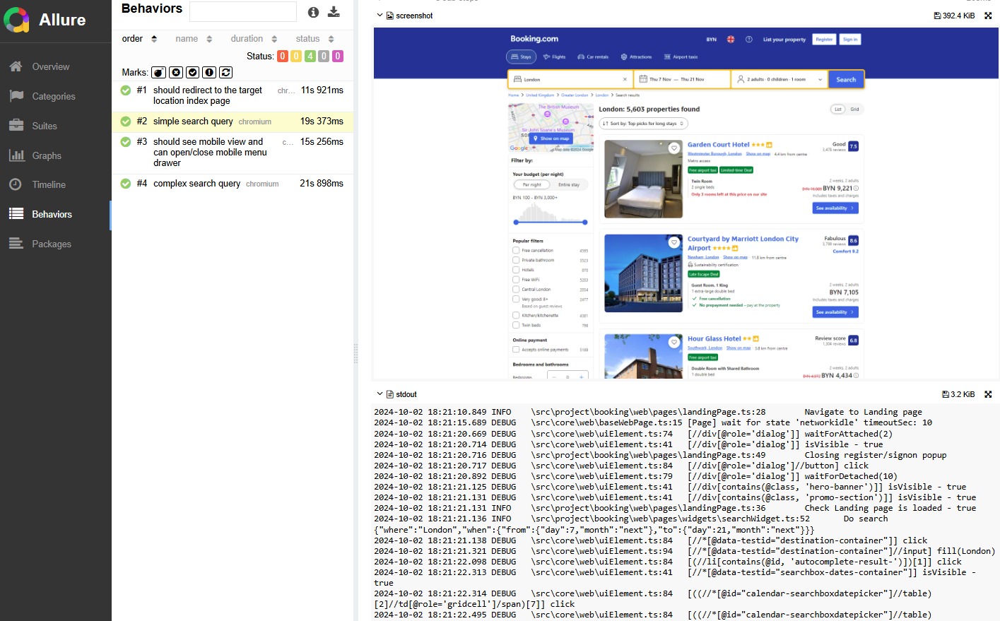
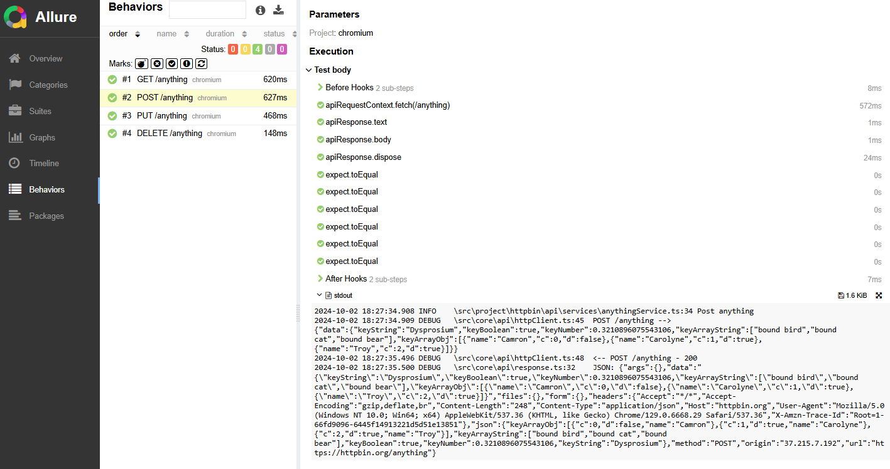

## playwright-typescript-starter

Test automation project boilerplate including packages structure, reporting, logging, multi-env run configuration for WEB and API test automation.

Pure Playwright APIs wrapped a little to add more logs/traceability to test execution and to make theirs usage less-verbose in tests.

Optionally Database and Email utils added as the example how the project can be extended.

#### Built with

| Type               | Tool/lib                                                        |
|--------------------|-----------------------------------------------------------------|
| Lang               | Typescript                                                      |
| Build/Management   | npm                                                             |
| Web/API Automation | playwright                                                      |
| Test Runner        | @playwright/test                                                |
| Logger             | tslog                                                           |
| Reporting          | Allure (allure-playwright) + Playwright html (@playwright/test) |

### Project Structure

- `src/core`  - project-agnostic code, common for any product/project to be automated
- `src/project`  - project-specific base code, including objects and utils for the particular project (pageobjects for web, services for api, utils, datagenerators, etc.)
- `src/test` - project test specs, grouped by directories, components, etc. also test config definition is there (base urls, etc.)


### Quick Start

_Do 4 steps_:
- `npm install` - install dependencies
- `npm run install-playwright` - install playwright browsers + dependencies
- `npm run health-check` - run `test/health-check.spec.ts` spec
- `npm run show-report-playwright` or `npm run show-report-allure` - show reports

#### Explore examples

- WEB automation: `project/booking/`, `test/booking/`
- API automation: `project/httpbin/`, `test/httpbin/`
- HYBRID WEB+API spec: `test/hybrid-web-api.spec.ts`

#### Run tests

_Short run commands from the`package.json`_:

- `npm run test-booking`
- `npm run test-httpbin`

_See the full commands_:

```shell
npm run clean && npx playwright test ./src/test/httpbin/ --project=chromium
```

```shell
npm run clean && npx playwright test ./src/test/booking/ --project=chromium --workers 4
```

- `--project` should be always provided not to cause the tests executed multiple times per each project 
    defined in `playwright.config.ts`. For api tests `--project` also should be provided, but will not take any effect.
- `--workers` option defines thread-count for parallel test execution, 1 worker is the default behaviour


#### Reporting

- `npm run show-report-playwright` - Default playwright report (static report generated to `output/html`)
- `npm run show-report-allure` - Allure report (static report generated to `output/allure-report`)




### Configuration

#### Playwright Test configuration

`playwright.config.ts` placed in the project root, it's provided by `@playwright/test` and no customizations added in the framework to handle it.

It allows to configure Playwright tool itself and also tests/reports.

Important concept here is the ability to define _projects_ - a set of launch configs grouped under some name, easy to refer in the test run command.

_Example_:

```typescript
import { PlaywrightTestConfig, devices, defineConfig } from '@playwright/test';
const ENV = process.env.ENV;

// have to define viewport, global ignored https://github.com/microsoft/playwright/issues/13673
const viewport = {
  width: 1920,
  height: 1080,
}

export default defineConfig({

  testDir: './src/test',

  /* Maximum time one test can run for. */
  timeout: 180 * 1000,
  expect: {
    timeout: 5000
  },
  reportSlowTests: {
    max: 5,
    threshold: 30 * 1000
  },
  outputDir: './output/test-results',

  /* Fail the build on CI if you accidentally left test.only in the source code. */
  forbidOnly: !!process.env.CI,
  retries: process.env.CI ? 2 : 0,
  workers: process.env.CI ? 1 : undefined,

  reporter: [
    ['html', { open: 'never', outputFolder: './output/html' }],
    ['allure-playwright', { outputFolder: './output/allure-results' }],
    ['junit', { outputFile: './output/junit-results/results.xml' }]
  ],

  use: {
    viewport: viewport,
    screenshot: 'on',
    trace: 'on-first-retry',
    actionTimeout: 10000,
    locale: 'en-GB',
    launchOptions: {
      slowMo: 100,
    },
  },

  projects: [
    {
      name: 'chromium',
      use: {
        ...devices['Desktop Chrome'],
        viewport: viewport, // have to define viewport
        channel: 'chrome',
        headless: true,
        launchOptions: {
          args: ["--disable-dev-shm-usage", '--disable-blink-features=AutomationControlled'],
          ignoreDefaultArgs: ['--disable-component-extensions-with-background-pages'],
          slowMo: 100,
        }
      },
    },
    {
      name: 'msedge',
      use: {
        ...devices['Desktop Edge'],
        viewport: viewport, // have to define viewport
        channel:'msedge',
        headless: true,
        launchOptions: {
          args: ["--disable-dev-shm-usage", '--disable-blink-features=AutomationControlled'],
          ignoreDefaultArgs: ['--disable-component-extensions-with-background-pages'],
          slowMo: 100,
        }
      },
    },
    {
      name: 'firefox',
      use: {
        ...devices['Desktop Firefox'],
        viewport: viewport, // have to define viewport
      },
    },
    {
      name: 'webkit',
      use: {
        ...devices['Desktop Safari'],
        viewport: viewport, // have to define viewport
      },
    },
  ],

});
```
see the full [reference](https://playwright.dev/docs/test-configuration).


#### Multi-env configuration

In the examples `process.env.npm_config_ENV` variable used to figure out the proper test configs.

```
static instance: TestConfig = new TestConfig(process.env.npm_config_ENV == undefined ? 'dev' : process.env.npm_config_ENV);
```

So, to switch env just provide `--ENV` in command-line.

- `npm run test-httpbin --ENV=dev` 
- `npm run test-httpbin --ENV=stage` 

Unknown or missing env value will be mapped to `dev`.

#### Per test-project configuration

Each test-project example goes with the `test/{projectName}/{projectName}TestConfigs.ts` 
script where the configs resolved based on the `--ENV` value.

_Example:_

```typescript
export class BookingTestConfig {

    readonly env: string;
    private readonly envConfigs: any;

    static instance: BookingTestConfig = new BookingTestConfig(process.env.npm_config_ENV == undefined ? 'dev' : process.env.npm_config_ENV);

    private devEnv = {
        web: { baseUrl: 'https://www.booking-dev.com' },
        api: { baseUrl: 'https://www.api.booking-dev.com' },
    }

    private qaEnv = {
        web: { baseUrl: 'https://www.booking-qa.com' },
        api: { baseUrl: 'https://www.api.booking-qa.com' },
    }

    private stageEnv = {
        web: { baseUrl: 'https://www.booking-stage.com' },
        api: { baseUrl: 'https://www.api.booking-stage.com' },
    }

    private constructor(env: string) {
        this.env = (env == undefined ? 'dev' : env).toLocaleLowerCase();;
        switch (env) {
            case 'qa': {
                this.envConfigs = this.qaEnv;
                break;
            }
            case 'stage': {
                this.envConfigs = this.stageEnv;
                break;
            }
            default: {
                this.envConfigs = this.devEnv;
                break;
            }
        }
    }

    getWebBaseUrl(): string {
        return this.envConfigs.web.baseUrl;
    }

    getApiBaseUrl(): string {
        return this.envConfigs.api.baseUrl;
    }
}
```


### Other Implementations

- [playwright-groovy-starter](https://github.com/daroshchanka/playwright-groovy-starter)
- [playwright-python-starter](https://github.com/daroshchanka/playwright-python-starter)